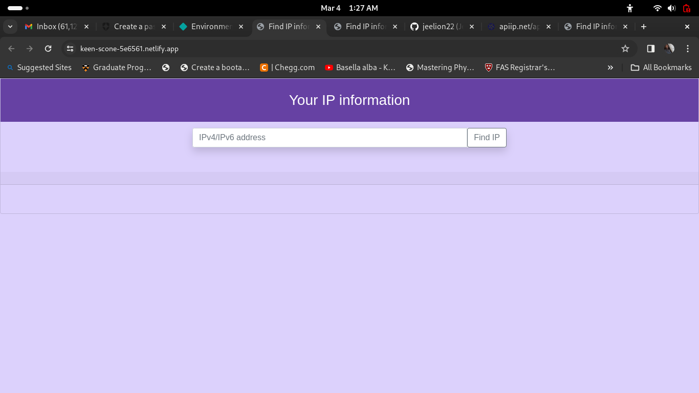
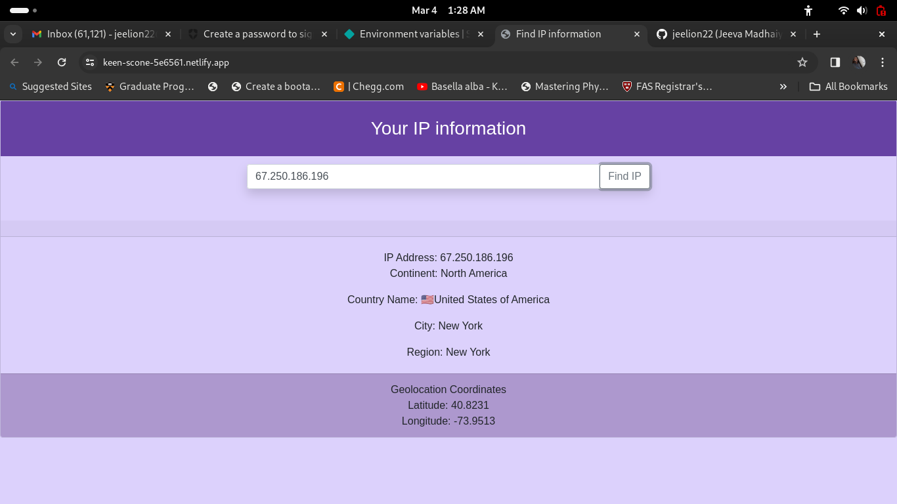
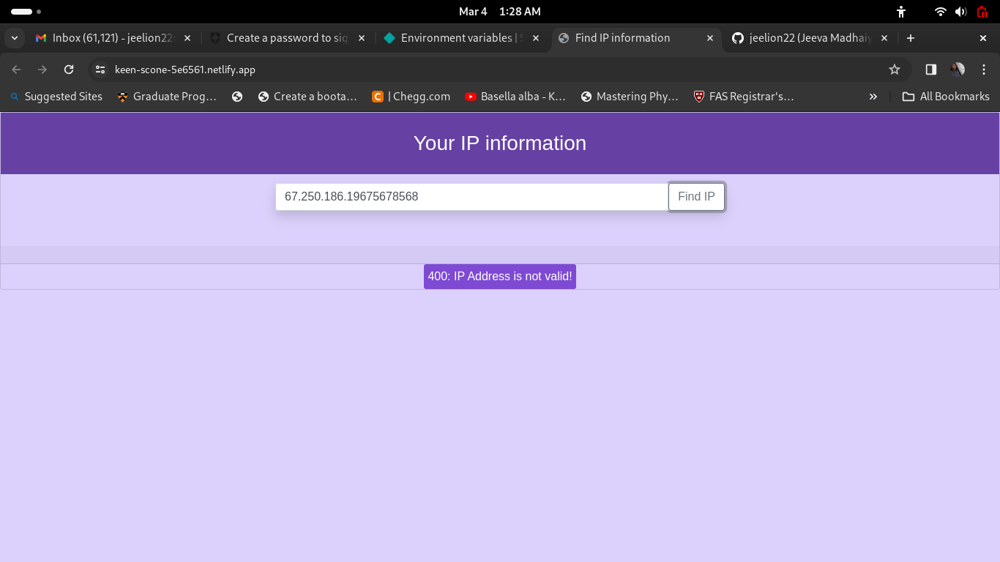

# Find IP Information

From this web page, we can find the information about the IP Address that we want, and it accepts both ipv4 and ipv6. 

Brief description of the project.

## Table of Contents

- [Introduction](#introduction)
- [Project Images](#Images)
- [Installation](#installation)
- [Usage](#usage)
- [License](#license)

## Introduction

To create this page, DOM is used to create HTML elements dynamically, for styling Bootstrap4.6 and exteranl css style sheet are used. IPv4 and IPv6 information can be obtained after clicking the 'Find IP' button. It gives location of the address such as continent, country, city, region, and the geocordinates of the ip address.

[Netlify link](https://keen-scone-5e6561.netlify.app/)

## Images

## Installation

No installation is required except a latest web browser.

## Usage

It can be used for IP specific information.

## License

MIT LIcence

---

